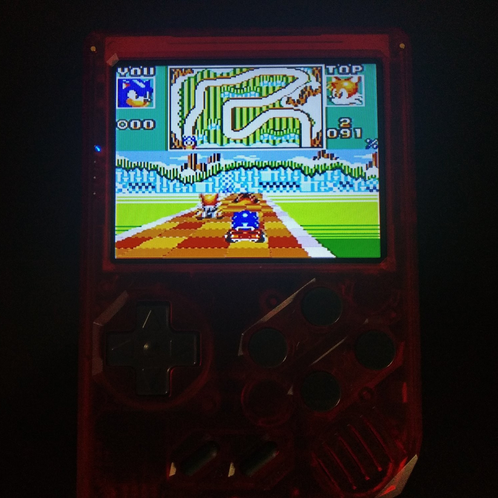

<b>UBoot</b>

Works as is, although uboot does not support composite output and directly outputs over HDMI instead.
This explains the issue i had with the screen being white & blue for a few seconds...
I seriously thought my screen was broken.

<b>Kernel</b>

Mainline kernel is pretty good and supports most of the hardware features except
for one critical flaw : it currently does not support composite output.
The Retrostone's LCD is plugged over composite and thus, we are stuck with Legacy kernel 3.4.

The legacy kernel has a few (a lot) of issues :
- The sound driver is completely awful, constantly underruns and sometimes outputs no sound.
I don't know how to fix this...
- While the DRM mali module works, it requires a proprietary firmware blobs, which has a dependency
on glibc. This makes it problematic if we insist on using uclibc or musl (see buildroot on why
i can't use glibc).

<b>Display</b>

<i>SMS Plus GX running over fbdev (Currently not using SDL for now)</i>
  
RetrOrangePi sets the resolution to 672x448.
However, this is not actually the maxed out resolution you can get without black borders.
The maximum resolution i could get is 680x448. Offsets are x: 33 and y : 18.
  
There are two displays opened, first one is the one we draw to (where the resolution is actually set)
and the second one, which seemingly refuses to change its resolution over composite, is for the final output.
(Linux says resolution of that one is 800x480)
  
RetrOrangePi sets the bitdepth to 32, which is too high for this device and also won't allow OpenDingux ports
as easily.
My distribution will set it to RGB565, which is value 10, not 4 as reported by the Sunxi wiki...
  
I also need to support HDMI output but this might not be easy given the odd resolution...
It's not a priority though, i'm focusing on getting something to work over the LCD.
  
<b>3D Acceleration</b>
  
Mali userspace blobs are built against glibc as i said above.
It's possible to use the mainline kernel and rebuild mesa with the soon-to-be-merged lima driver but
mainline kernel does not support CVBS so we're out of luck.
Sunxi devs, if you are looking at this, hopefully you can find someone gentle enough to get this working over CVBS...

For now, we will do without 3D acceleration (and just using the DRM interface), this is what most opendingux devices did after all.
(Besides, the Mali 400 isn't exactly the most powerful GPU out there)

<b>Sound</b>

The sound driver is garbage : It constantly underruns, sometimes outright refusing to output any sound.
I heard that mainline has a more robust implementation but again, no luck for us here...

TODO : Look at whenever it actually checks my .asoundrc/asound.conf files...
 cat /proc/asound/card1/pcm0p/sub0/hw_params
 cat /proc/asound/card0/pcm0p/sub0/hw_params
 
 <b>Input</b>
 
RetrOrangePi handles input by creating a virtual device with uinput, and it does this through a python script.
We want to do something like this but :
- Make it C instead as to avoid a dependency on python.
- Map it as a virtual keyboard to allow OpenDingux ports.

  
<b>Userspace</b>
  
Using directly fbdev works fine but for some reasons, SDL refuses to display properly over fbdev.
I suspect this may have to do with the allocated framebuffer, as that can cause issues on the old DRM driver.
(as i've seen with my FBDEV example)

Looks like SDL will require a patch to force it to 16bpp among other useful things like ASYNC blitting (useful on our 4 cores),
ANYFORMAT as to ignore the screen's depth etc...
